# Soul Echoes screenshots

这个仓库只存放 `mark_two` 项目的公开演示截图，不包含项目源码。

## Windows playtest build

[Download SoulEchoes for Windows x64](downloads/SoulEchoes_Windows_x64.zip)

- ZIP size: 37.45 MiB
- Requires: 64-bit Windows
- SHA-256: `3240591E6969A17C2F5FAB1CEFC5897B8FC187A4F12256DF3EC1DD30C144D35B`
- Contains only the exported `SoulEchoes.exe`; project source files are not included.

## Milestone 2

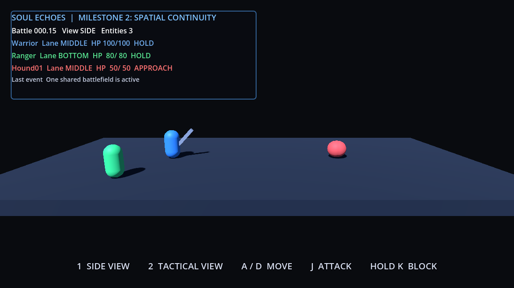

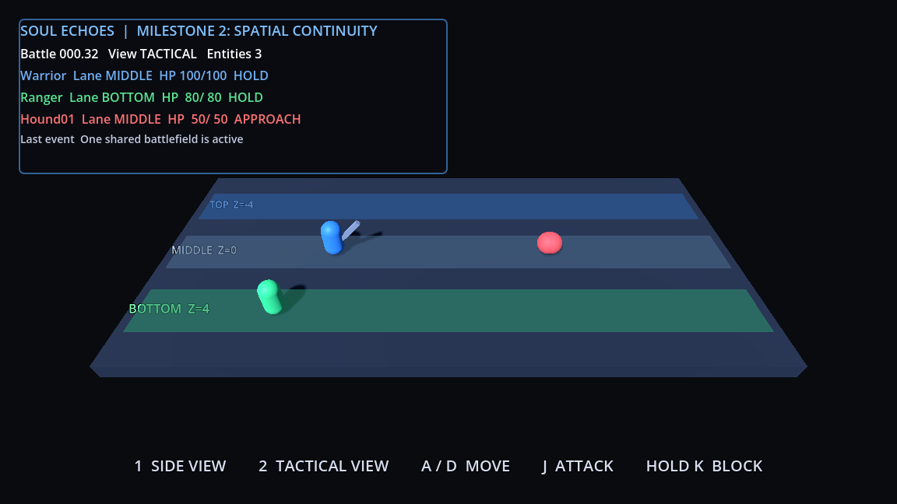

## Milestone 3

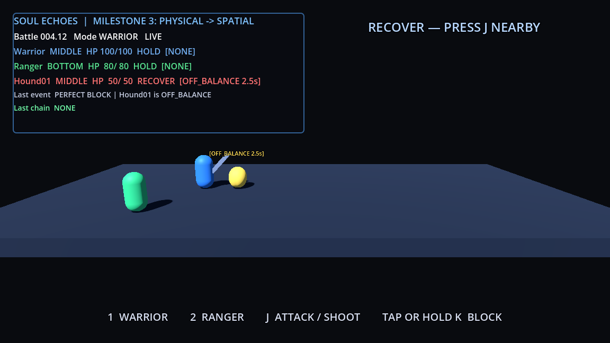

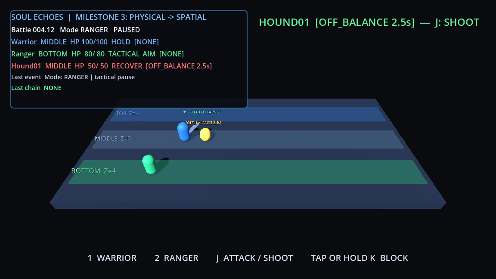

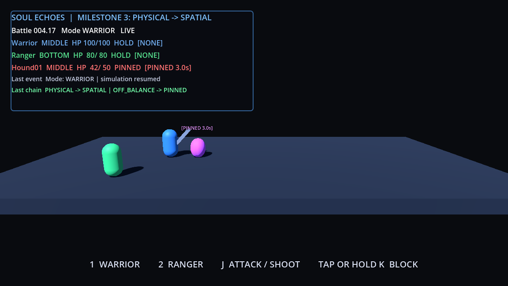

## Milestone 4

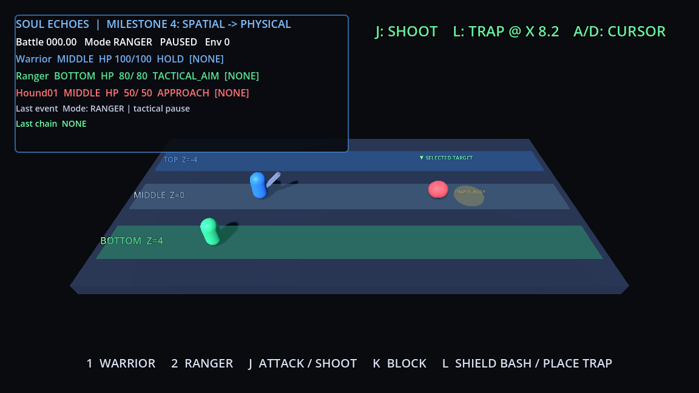

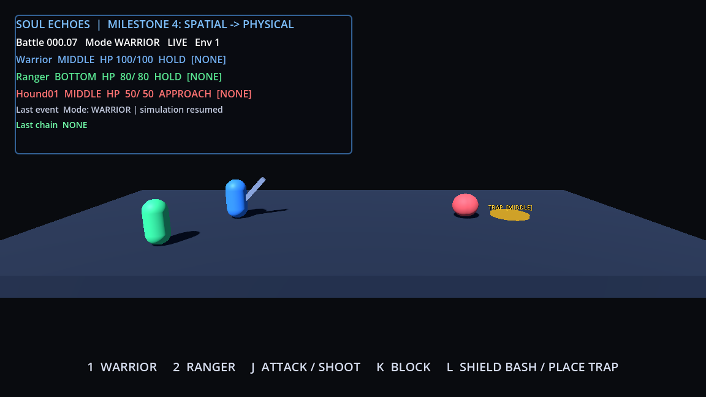

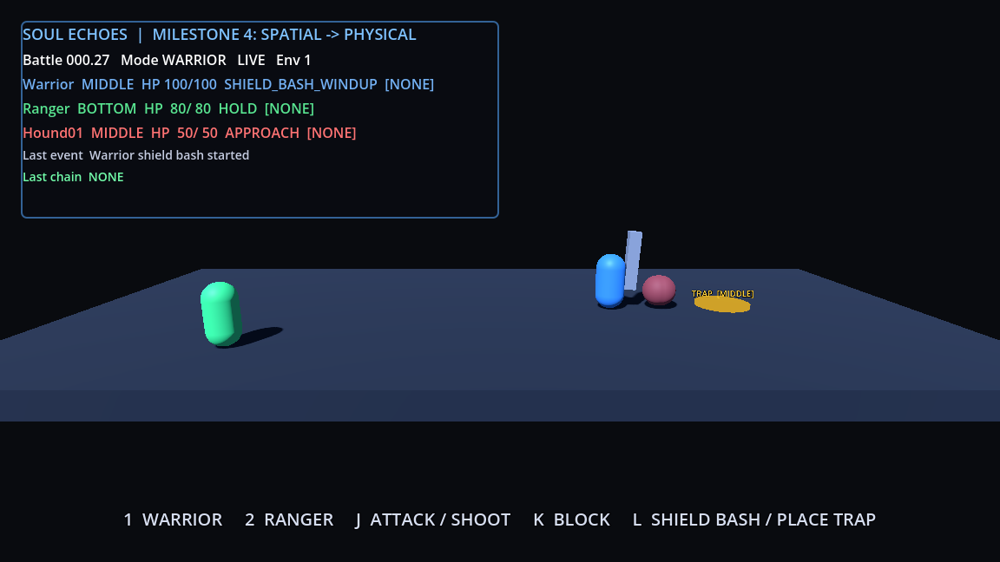

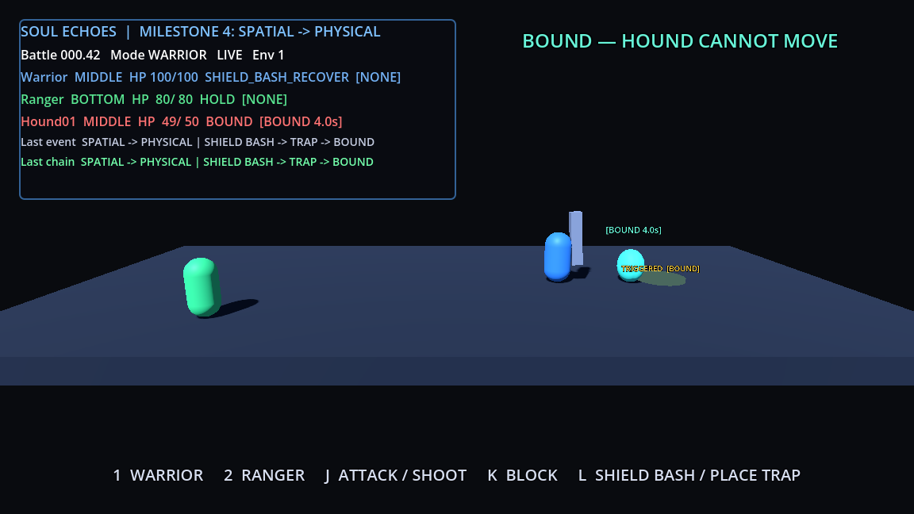

## Milestone 5

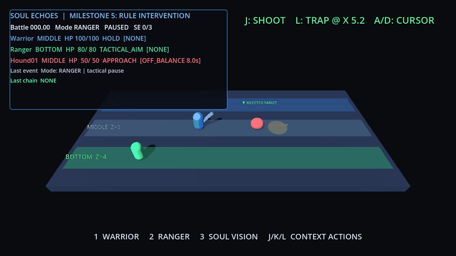

## Milestone 6

Six real gameplay key frames, displayed for two seconds each:

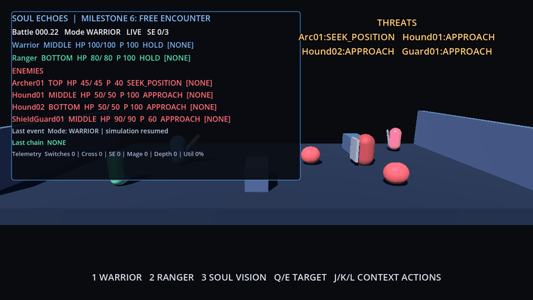

## Playtest UI optimization

Start/pause menu, compact debug HUD, overhead entity info, projectile impact, and
Ranger/Mage mode persistence. Each key frame is displayed for two seconds.

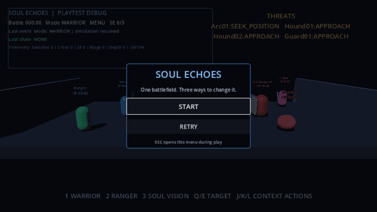
