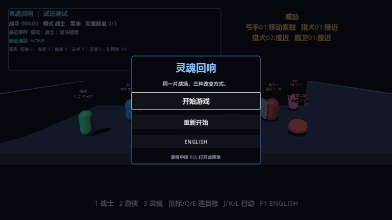
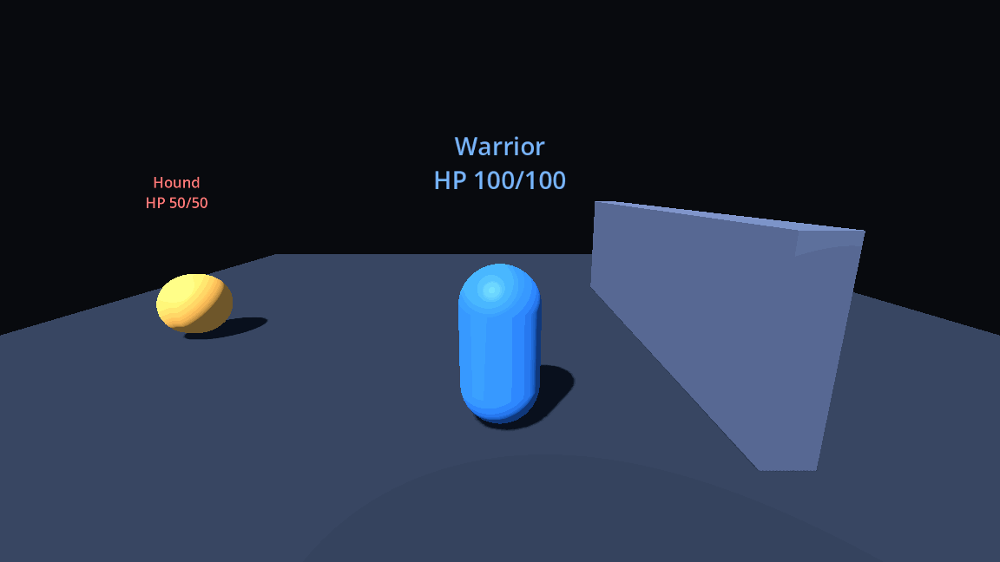
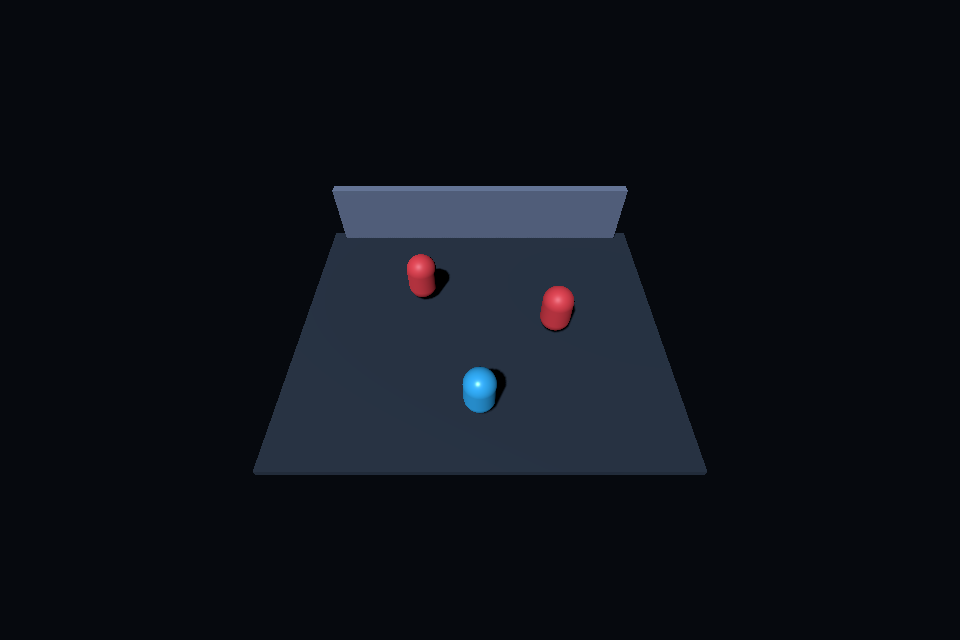
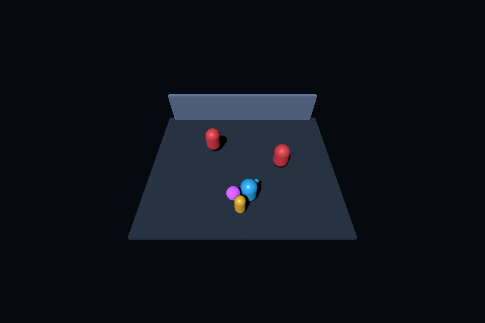
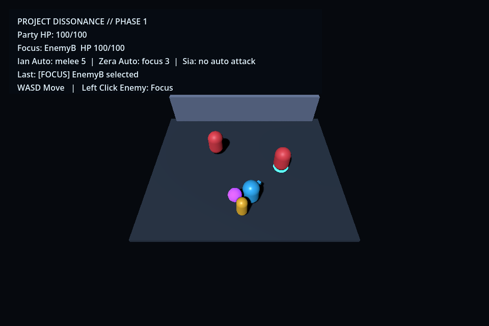
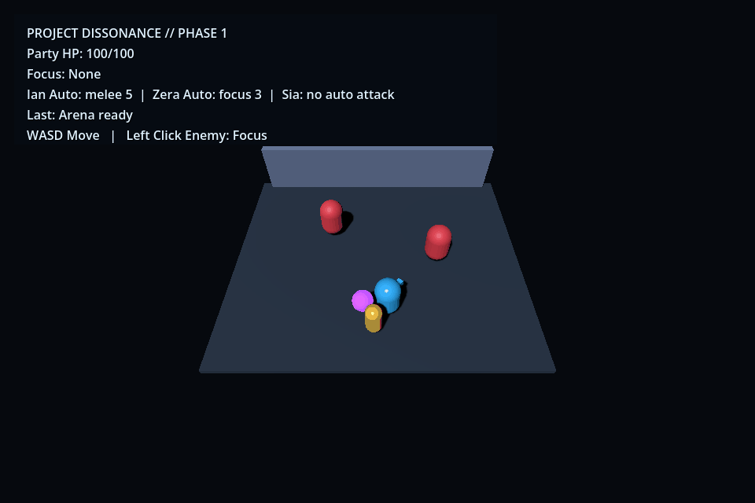

# Public game prototype media

这个仓库只存放 `mark_two` / Soul Echoes 与 Project Dissonance 的公开演示媒体，
不包含任何项目源码。

## 项目文档

[查看《灵魂回响》Demo 项目结构与实现总结](PROJECT_IMPLEMENTATION_SUMMARY.md)

## Windows playtest build

[Download SoulEchoes for Windows x64](downloads/SoulEchoes_Windows_x64.zip)

- ZIP size: 37.45 MiB
- Requires: 64-bit Windows
- SHA-256: `3240591E6969A17C2F5FAB1CEFC5897B8FC187A4F12256DF3EC1DD30C144D35B`
- Contains only the exported `SoulEchoes.exe`; project source files are not included.

## Milestone 2

## Milestone 3

## Milestone 4

## Milestone 5

## Milestone 6

Six real gameplay key frames, displayed for two seconds each:

## Playtest UI optimization

Start/pause menu, compact debug HUD, overhead entity info, projectile impact, and
Ranger/Mage mode persistence. Each key frame is displayed for two seconds.

## Combat usability update

Enemy exit animation, Ranger auto-seeking and tactical target selection, ranged
perfect-block reflection, Chinese UI, and combat feedback. Each key frame is
displayed for two seconds.

## Experimental Arena — Step 1

Third-person 3D movement, the reused Hound charge, damage feedback, and solid wall
collision. This is the Step 1 shell; Warrior combat is intentionally deferred to
Step 2. Each key frame is displayed for two seconds.

## Project Dissonance — Phase 1 Steps 1–3

These are real Godot 4.7.2 OpenGL gameplay captures from the matching private
source milestones. No project source files are published here.

- Step 1 source commit: `b9dd0df` — arena skeleton and PartyRoot movement.
- Step 2 source commit: `d6ba9c5` — three-character visual formation.
- Step 3 source commit: `5bf98e2` — Focus marker, baseline auto combat, Party HP, and HUD.

### Step 1

### Step 2

### Step 3

EnemyB is selected in this capture so the Focus marker is visible.

### Step 3 battle process

This continuous real-render capture shows the formal click-ray Focus selection,
both enemies closing in, Ian and Zera auto attacks, enemy retaliation, and the
shared Party HP changing during the same battle run.

